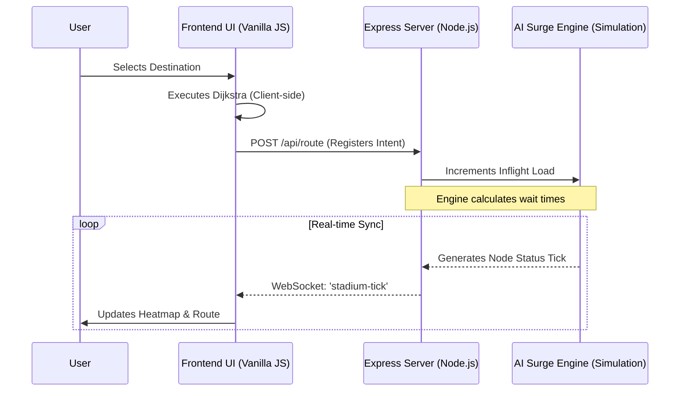
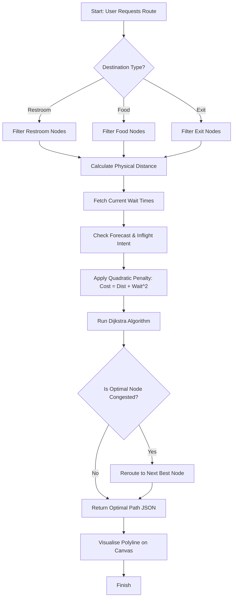
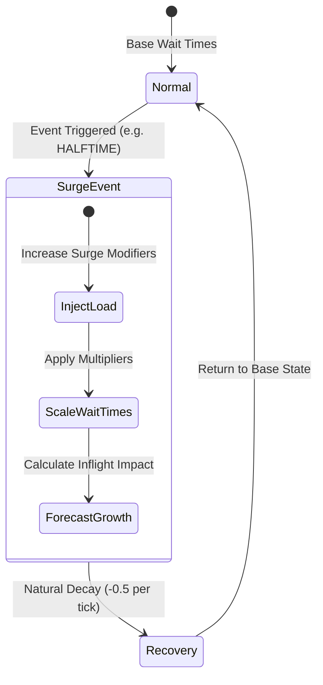

# System Flowcharts: Smart Stadium AI

This document visualizes the architectural flow and decision-making logic of the Smart Stadium Routing Engine.

## 1. System Data Flow
This diagram illustrates how data travels between the User, the Frontend UI, and the Backend Simulation Engine.

## 2. Routing Decision Logic (Dijkstra + Density)
This flowchart shows how the engine determines the "Optimal Path" by balancing physical distance against crowd load.

## 3. Surge Event Lifecycle
How the system reacts to a stadium-wide event like a "Goal" or "Halftime."

